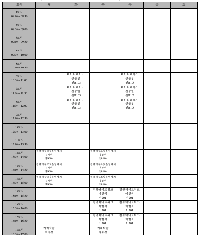

# Academic Administration DB
> Database GUI for academic administration of Sejong Univ.

### Last Update
2021.06.29.

### Outline | 개요

세종 학사관리 데이터베이스에 대한 요구사항은 다음과 같다.

- 모든 학생은 학생번호를 부여하여 식별하며 학생이름, 학생주소. 학생전화번호. 학생이메일, 전공 학과, 지도교수 정보, 등록금 납부 계좌 정보를 가진다. 학생은 부전공을 1개까지 신청할 수 있다. 학생은 한학기에 최대 10학점까지만 수강 할 수 있다.
- 교수는 소속학과가 반드시 있어야 하고, 학생을 반드시 담당해야 하며, 강좌에 대한 강의를 반드시 해야 한다. 교수는 1개 이상의 복수 학과에 소속이 가능하다.
- 모든 교수는 교수번호를 부여하여 식별하며 교수이름, 교수주소, 교수전화번호. 교수이메일. 소속 학과번호 정보를 가진다.
- 교수와 학생은 학생번호와 교수번호를 이용한 지도 관계를 가지며, 해당 관계에는 현재 학년/학기 정보를 포함한다.
- 학과는 학과번호를 부여하여 식별하며 학과명, 학과전화번호, 학과사무실 정보를 가진다. 해당 학과에서 개설하는 강좌가 반드시 1개 이상 존재해야 하며, 동시에 학과장이 1명 있어야 한다.

- 강좌는 강좌번호, 분반번호, 강의하는 교수, 강좌이름, 강의요일, 강의교시, 취득학점 (1-4), 강좌시간 (1-6), 개설 학과, 강의실 정보가 필요하다.

- 수강내역은 학생번호, 강좌번호. 교수번호를 부여하여 식별하며 출석점수, 중간고사점수, 기말고사점수, 기타 점수, 총점 (0 ~ 100), 평점 (A ~ F) 정보를 가진다.

- 학생은 1개 이상의 동아리에 가입이 가능하다. 동아리는 동아리 번호, 동아리 이름, 소속 학생 숫자, 회장 학생 정보, 동아리 지도 교수 정보, 동아리방 정보 등을 가져야 한다.

- 학생별 등록금 납부 내역을 기록해야 한다. 학생 번호, 등록금 납부 연도, 등록금 납부 학기, 등록금 총액, 납부 총액, 마지막 납부 일자가 기록되야 한다. 납부 총액이 등록금 총액 보다 작을 경우에는 수강내역 “신규 삽입”에서 “등록금 미납”오류를 표시해야 한다.

#### [Details | 세부 설계](./details.md)

> 본 내용에 대한 세부적인 설계 사항이다.

### Development Tools | 개발 언어 및 개발 도구

- **DBMS** : MySQL 8.0.15 or later
- **Language** : JAVA (Oracle JAVA SE 11 이상)
- **Tool** : Eclipse

 

### Environment | 개발 환경

- UI: 기본 JDK에 포함된 GUI (Graphical User Interface) library를 사용
- 개발도구: Eclipse

 

### Requirements Statement & Schema Definition | 요구사항 명세서 및 스키마 정의서

> [Details](./details.md)

- 요구사항 명세서에는 데이터베이스 설계에 필요한 사용자 요구사항을 항목별로 정리 (사용자 인터페이스 및 구현될 삽입/삭제/변경/검색 기능과 관련된 요구사항 포함)
- 스키마 정의는 MySQL의 EER Diagram 도구를 활용
- 프로그램의 테스트를 위해서 스키마 설계를 한 후에 각 테이블에 대한 “샘플” 데이터 생성

 

### Requirements | 개발 요구사항

> 모든 내용은 하나의 창 안에서 작동해야 한다.
   
1. **Manager**: 관리자에 대해서 다음의 기능을 구현한다.
   - 데이터베이스 초기화 기능
   - 데이터베이스에 포함된 모든 테이블에 대한 입력/삭제/변경 기능
     > 삭제/변경은 “1개”의 고정된 특정 조건이 아닌 “조건식”을 입력 받아서 삭제/변경하는 방식
   - 전체 테이블 보기 기능 : 모든 테이블의 내용을 보여주는 기능

2. **Professor**: 교수 사용자에 대해서 다음의 기능을 구현한다.
   - 입력된 연도/학기에 본인이 강의했던 과목에 대한 모든 정보를 보여주는 기능
   - 위에서 표시된 과목 정보 중에서 하나를 클릭하면 해당 과목을 수강하는 (혹은 수강했던) 모든 학생에 대한 정보를 보여주는 기능
   - 현재 본인이 지도하는 학생에 대한 정보를 보여주는 기능
   - 위에서 표시된 학생 정보 중에서 하나를 클릭하면 해당 학생이 수강했던 (혹은 수강하고 있는) 모든 과목에 대한 성적 정보를 보여주는 기능
   - 본인이 소속된 학과에 대한 정보(학과장 정보 포함)를 보여주는 기능
   - 현재 학기에 대한 “강의 시간표” 표시 기능 : 현재 학기에 강의하는 과목을 시간표 형태로 표시함. 시간표는 요일/교시
   - 현재 본인이 강의하는 과목에 대한 성적 입력 기능
   
3. **Student**: 학생 사용자에 대해서 다음의 기능을 구현한다.
   - 입력된 연도/학기에 본인이 수강했던 과목에 대한 모든 정보를 보여주는 기능
   - 현재 학기에 본인이 수강하는 모든 과목을 시간표 형태로 표시하는 기능
   - 본인이 소속된 동아리에 대한 정보를 보여주는 기능
     단, 동아리 회장의 경우에는 동아리에 “속한” 모든 학생들에 대한 정보
   - 본인의 성적표를 보여주는 기능 : 과목번호/과목명/취득학점/평점과 GPA (grade point average)도 표시

- “입력” 기능의 경우 하나의 윈도우 안에서 모든 데이터를 기입하고 버튼 클릭 한번으로 입력되도록 구현함.  
  <u>*ex) 입력해야할 속성이 4개라면, 속성1/속성2/속성3/속성4에 대한 입력값을 하나의 GUI 윈도우에서 입력받아야 하며, 저장/취소 버튼이 있어서 저장 (즉, 입력 실행) 혹은 취소 (입력 취소) 기능이 구현.*</u>

- 오류 처리 : 제약조건을 벗어난 입력값에 대해서는 적절한 오류 메시지를 표시하고 저장이 안 됨.

- 데이터베이스 초기화 기능은 다음의 SQL을 이용해서 구현함

  - `drop table if exists`
  - `create table`
  - `insert into`

- 시간표 표시 예시

  

   

### To Do

1. Manager(Admin) 창 기능 완성 (insert, delete, update)
   - Professor
   - ~~Student~~ (delete, update 추가해야 함)
   - Department
   - Lecture
   - Course
   - Club
   - Club Member
   - Tuition
2. 모든 창에 Status Text Area 추가
3. Professor mode
   - `My Department` query 수정 필요 (학과장 정보 따로 출력할 수 있도록)
4. Student mode
   - `Report Card` 기능 추가
5. Time Table feature 추가
