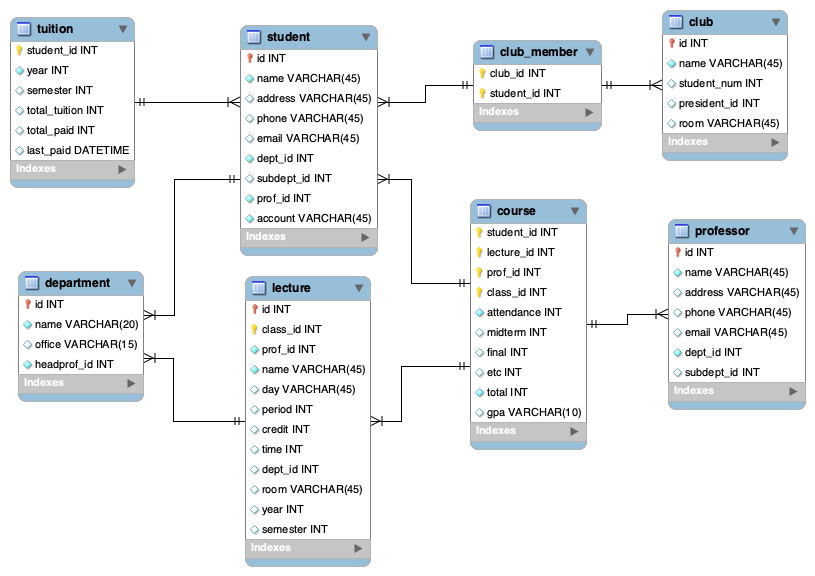

# Requirements Statement / Schema
> **요구사항 명세서 및 스키마 정의** 데이터베이스 설계에 필요한 사용자 요구사항을 항목별로 정리한 내용.  
> (사용자 인터페이스 및 구현될 삽입/삭제/변경/검색 기능과 관련된 요구사항도 모두 포함)

### EER Diagram | EER 다이어그램

### Tables | 테이블

- **Student**: 모든 학생은 학생번호를 부여하여 식별하며 학생이름, 학생주소. 학생전화번호. 학생이메일, 전공 학과, 지도교수 정보, 등록금 납부 계좌 정보를 가진다. 학생은 부전공을 1개까지 신청할 수 있다. 학생은 한학기에 최대 10학점까지만 수강 할 수 있다.

  - **id** 학생 번호
  - **name** 학생 이름
  - **address** 학생 주소
  - **phone** 학생 전화번호
  - **email** 학생 이메일
  - **dept_id** 전공 학과
  - **subdept_id** 부전공 학과 (최대 1개)
  - **prof_id** 지도 교수
  - **account** 등록금 납부 계좌

  ~~~mysql
  CREATE TABLE IF NOT EXISTS `sejong`.`student` (
    `id` INT NOT NULL,
    `name` VARCHAR(45) NOT NULL,
    `address` VARCHAR(45) NULL,
    `phone` VARCHAR(45) NULL,
    `email` VARCHAR(45) NULL,
    `dept_id` INT NOT NULL,
    `subdept_id` INT NULL,
    `prof_id` INT NOT NULL,
    `account` INT NOT NULL,
    PRIMARY KEY (`id`),
    INDEX `idx_deptid` (`dept_id`),
    CONSTRAINT `fk_student_course1`
      FOREIGN KEY (`id`)
      REFERENCES `sejong`.`course` (`student_id`)
      ON DELETE NO ACTION
      ON UPDATE NO ACTION,
    CONSTRAINT `fk_student_club_member1`
      FOREIGN KEY (`id`)
      REFERENCES `sejong`.`club_member` (`student_id`)
      ON DELETE NO ACTION
      ON UPDATE NO ACTION,
    CONSTRAINT `fk_student_tuition1`
      FOREIGN KEY (`id`)
      REFERENCES `sejong`.`tuition` (`student_id`)
      ON DELETE NO ACTION
      ON UPDATE NO ACTION)
  ENGINE = InnoDB;
  ~~~

  

- **Professor**: 교수는 소속학과가 반드시 있어야 하고, 학생을 반드시 담당해야 하며, 강좌에 대한 강의를 반드시 해야 한다. 교수는 1개 이상의 복수 학과에 소속이 가능하다. 모든 교수는 교수번호를 부여하여 식별하며 교수이름, 교수주소, 교수전화번호. 교수이메일. 소속 학과번호 정보를 가진다.

  - **id** 교수 번호
  - **name** 교수 이름
  - **address** 교수 주소
  - **phone** 교수 전화번호
  - **email** 교수 이메일
  - **dept_id** 소속 학과
  - **subdept_id** 복수 학과 (1개 이상 가능)

  ~~~mysql
  CREATE TABLE IF NOT EXISTS `sejong`.`professor` (
    `id` INT NOT NULL,
    `name` VARCHAR(45) NOT NULL,
    `address` VARCHAR(45) NULL,
    `phone` VARCHAR(45) NULL,
    `email` VARCHAR(45) NULL,
    `dept_id` INT NOT NULL,
    `subdept_id` INT NULL,
    PRIMARY KEY (`id`),
    CONSTRAINT `fk_professor_course`
      FOREIGN KEY (`id`)
      REFERENCES `sejong`.`course` (`prof_id`)
      ON DELETE NO ACTION
      ON UPDATE NO ACTION)
  ENGINE = InnoDB;
  ~~~

  > 교수와 학생은 학생번호와 교수번호를 이용한 지도 관계를 가지며, 해당 관계에는 현재 학년/학기 정보를 포함한다.

- **Department**: 학과는 학과번호를 부여하여 식별하며 학과명, 학과전화번호, 학과사무실 정보를 가진다. 해당 학과에서 개설하는 강좌가 반드시 1개 이상 존재해야 하며, 동시에 학과장이 1명 있어야 한다.

  - **id** 학과 번호
  - **name** 학과 이름
  - **phone** 학과 전화번호
  - **office** 학과 사무실
  - **lecture** 개설 강좌
  - **head_professor** 학과장 (1명)

  ~~~mysql
  CREATE TABLE IF NOT EXISTS `sejong`.`department` (
    `id` INT NOT NULL,
    `name` VARCHAR(20) NOT NULL,
    `office` VARCHAR(15) NULL DEFAULT NULL,
    `headprof_id` INT NOT NULL,
    PRIMARY KEY (`id`),
    CONSTRAINT `fk_department_student1`
      FOREIGN KEY (`id`)
      REFERENCES `sejong`.`student` (`dept_id`)
      ON DELETE NO ACTION
      ON UPDATE NO ACTION,
    CONSTRAINT `fk_department_lecture1`
      FOREIGN KEY (`id`)
      REFERENCES `sejong`.`lecture` (`dept_id`)
      ON DELETE NO ACTION
      ON UPDATE NO ACTION)
  ENGINE = InnoDB
  DEFAULT CHARACTER SET = utf8mb4
  COLLATE = utf8mb4_0900_ai_ci;
  ~~~

  

- **Lecture**: 강좌는 강좌번호, 분반번호, 강의하는 교수, 강좌이름, 강의요일, 강의교시, 취득학점 (1~4), 강좌시간 (1~6), 개설 학과, 강의실 정보가 필요하다.

  - **id** 강좌 번호
  - **class_id** 분반 번호
  - **professor** 강의 교수
  - **name** 강좌 이름
  - **day** 강의 요일
  - **period** 강의 교시
  - **credit** 취득 학점
  - **time** 강좌 시간
  - **dept_id** 개설 학과
  - **room** 강의실

  ~~~mysql
  CREATE TABLE IF NOT EXISTS `sejong`.`lecture` (
    `id` INT NOT NULL,
    `class_id` INT NOT NULL,
    `prof_id` INT NOT NULL,
    `name` VARCHAR(45) NOT NULL,
    `day` VARCHAR(45) NULL DEFAULT NULL,
    `period` INT NULL DEFAULT NULL,
    `credit` INT NULL DEFAULT NULL,
    `time` INT NULL DEFAULT NULL,
    `dept_id` INT NULL DEFAULT NULL,
    `room` VARCHAR(45) NULL DEFAULT NULL,
    `year` INT NULL,
    `semester` INT NULL,
    PRIMARY KEY (`id`, `class_id`),
    INDEX `idx_deptid` (`dept_id` ASC) VISIBLE,
    CONSTRAINT `fk_lecture_course1`
      FOREIGN KEY (`id`)
      REFERENCES `sejong`.`course` (`lecture_id`))
  ENGINE = InnoDB
  DEFAULT CHARACTER SET = utf8mb4
  COLLATE = utf8mb4_0900_ai_ci;
  ~~~

- **Course**: 수강내역은 학생번호, 강좌번호. 교수번호를 부여하여 식별하며 출석점수, 중간고사점수, 기말고사점수, 기타 점수, 총점 (0 ~ 100), 평점 (A ~ F) 정보를 가진다.

  - **student_id** 학생 번호
  - **lecture_id** 강좌 번호
  - **prof_id** 교수 번호
  - **attendance** 출석 점수
  - **midterm** 중간고사 점수
  - **final** 기말고사 점수
  - **etc** 기타 점수
  - **total** 총점
  - **gpa** 평점

  ~~~mysql
  CREATE TABLE IF NOT EXISTS `sejong`.`course` (
    `student_id` INT NOT NULL,
    `lecture_id` INT NOT NULL,
    `prof_id` INT NOT NULL,
    `attendance` INT NOT NULL,
    `midterm` INT NULL,
    `final` INT NULL,
    `etc` INT NULL,
    `total` INT NULL,
    `gpa` VARCHAR(10) NULL,
    PRIMARY KEY (`student_id`, `lecture_id`, `prof_id`),
    INDEX `idx_lectureid` (`lecture_id`),
    INDEX `idx_studentid` (`student_id`),
    INDEX `idx_prof_id` (`prof_id`))
  ENGINE = InnoDB
  DEFAULT CHARACTER SET = utf8mb4
  COLLATE = utf8mb4_0900_ai_ci;
  ~~~

- **Club**: 학생은 1개 이상의 동아리에 가입이 가능하다. 동아리는 동아리 번호, 동아리 이름, 소속 학생 숫자, 회장 학생 정보, 동아리 지도 교수 정보, 동아리방 정보 등을 가져야 한다.

  - **id** 동아리 번호
  - **name** 동아리 이름
  - **student_num** 동아리 학생 수
  - **president** 동아리 회장
  - **prof_id** 동아리 지도 교수
  - **room** 동아리방

  ~~~mysql
  CREATE TABLE IF NOT EXISTS `sejong`.`club` (
    `id` INT NOT NULL,
    `name` VARCHAR(45) NOT NULL,
    `student_num` INT NULL,
    `president_id` INT NULL,
    `room` INT NULL,
    PRIMARY KEY (`id`),
    CONSTRAINT `fk_club_club_member1`
      FOREIGN KEY (`id`)
      REFERENCES `sejong`.`club_member` (`club_id`)
      ON DELETE NO ACTION
      ON UPDATE NO ACTION)
  ENGINE = InnoDB;
  ~~~

  - mapping table

  ~~~mysql
  CREATE TABLE IF NOT EXISTS `sejong`.`club_member` (
    `club_id` INT NOT NULL,
    `student_id` INT NOT NULL,
    PRIMARY KEY (`club_id`, `student_id`),
    INDEX `idx_clubid` (`club_id`),
    INDEX `idx_studentid` (`student_id`)
  )
  ENGINE = InnoDB;
  ~~~

  

- **Tuition**: 학생별 등록금 납부 내역을 기록해야 한다. 학생 번호, 등록금 납부 연도, 등록금 납부 학기, 등록금 총액, 납부 총액, 마지막 납부 일자가 기록되야 한다. 납부 총액이 등록금 총액 보다 작을 경우에는 수강내역 “신규 삽입”에서 “등록금 미납”오류를 표시해야 한다.

  - **student_id** 학생 번호
  - **year** 등록금 납부 연도
  - **semester** 등록금 납부 학기
  - **total_tuition** 등록금 총액
  - **total_paid** 납부 총액
  - **last_paid** 마지막 납부 일자
  
  ~~~mysql
  CREATE TABLE IF NOT EXISTS `sejong`.`tuition` (
    `id` INT NOT NULL,
    `student_id` INT NOT NULL,
    `year` INT NOT NULL,
    `semester` INT NULL,
    `total_tuition` INT NULL,
    `total_paid` INT NULL,
    `last_paid` DATETIME NULL,
    PRIMARY KEY (`id`),
    INDEX `idx_studentid` (`student_id`))
  ENGINE = InnoDB;
  ~~~
  
  

---

### Requirements | 개발 요구사항

> 모든 내용은 하나의 창 안에서 작동해야 한다.

1. 사용자 계정은 madang/madang 으로 코드에 포함시킨다. 즉, 프로그램을 구동하면 바로 MySQL로 접속되어 사용 가능해야 함.
   - Eclipse의 JAVA Project 이름은 반드시 제출자의 “학번”으로 정한다.
     *예) 학번이 18013001 인 경우 제출하는 압축파일 안의 프로젝트 디렉토리 명이 반드시 18013001 이어야 함.*

2. MySQL 접속 코드는 중간고사 시에 제공된 샘플코드와 “동일”한 코드를 사용한다. (이외의 접속 코드 사용시에는 0점 처리됨)
   
   ~~~java
   static Connection con;
   Statement stmt;
   ResultSet rs;
   String Driver = "";
   String url = "jdbc:mysql://localhost:3306/madang?&serverTimezone=Asia/Seoul&useSSL=false";
   String userid = "madang";
   String pwd = "madang";
   ~~~
   
   
   
3. 접속 후에는 관리자/교수/학생에 대한 기능을 구현한다. 단, 채점의 용이성을 위해서 관리자/일반사용자 모두 madang 계정을 이용한다. 즉, madang 계정으로 자동 로그인 한후, GUI 화면에서 관리자/교수/학생을 택하여 다음 화면으로 넘어가는 형태로 구현한다.

   > sql level까지는 안내려옴

   

4. **Manager**: 관리자에 대해서 다음의 기능을 구현한다.

   - 데이터베이스 초기화 기능

     - `reset`

     > sejong.sql 파일 불러와서 실행

   - 데이터베이스에 포함된 모든 테이블에 대한 입력/삭제/변경 기능  
     (단, 삭제/변경은 “1개”의 고정된 특정 조건이 아닌 “조건식”을 입력 받아서 삭제/변경하는 방식으로 구현해야 함)

     - `insert`
     - `delete`
     -  `update`

   - 전체 테이블 보기 기능: 모든 테이블의 내용을 보여주는 기능

     - `student`
     - `professor`
     - `department`
     - `lecture`
     - `course`
     - `club`
     - `club_member`
     - `tuition`

   

5. **Professor**: 교수 사용자에 대해서 다음의 기능을 구현한다.

   - `show lectures`: 입력된 연도/학기에 본인이 강의했던 과목에 대한 모든 정보를 보여주는 기능

     - `(lecture)`: 위에서 표시된 과목 정보 중에서 하나를 “클릭”하면 해당 과목을 수강하는 (혹은 수강했던) 모든 학생에 대한 정보를 보여주는 기능
     - `scoring`: 현재 본인이 강의하는 과목에 대한 성적 입력 기능

     ~~~mysql
     # 입력 연도/학기에 따른 강의 과목 보기
     select * from lecture
     where prof_id = (교수 ID) and year = (연도) and semester = (학기);

   - `show students`: 현재 본인이 “지도”하는 학생에 대한 정보를 보여주는 기능

     - `(student)`: 위에서 표시된 학생 정보 중에서 하나를 “클릭”하면 해당 학생이 수강했던 (혹은 수강하고 있는) 모든 과목에 대한 “성적” 정보를 보여주는 기능

       > 과목명도 보여줘야 하는가?

     ~~~mysql
     # 지도 학생 보기
     select * from student
     where prof_id = (교수 ID);
     
     # 학생 성적 보기
     select * from course
     where student_id = (학생 ID);
     ~~~

     

   - `my department`: 본인이 소속된 학과에 대한 정보(학과장 정보 포함)를 보여주는 기능

     ~~~mysql
     # 소속 학과 보기
     select * from department
     where id = (select dept_id from student s
     			where s.id = (학생 ID));
     ~~~

     

   - `time table`: 현재 학기에 대한 “강의 시간표” 표시 기능 (현재 학기에 강의하는 과목을 시간표 형태로 표시함. 시간표는 요일/교시)

     > 이건 진짜 어떻게 해야하는것일까?

     

   

6. **Student**: 학생 사용자에 대해서 다음의 기능을 구현한다.
   - `show lectures`: 입력된 연도/학기에 본인이 수강했던 과목에 대한 모든 정보를 보여주는 기능

     ~~~mysql
     # 입력 연도/학기에 따른 수강 과목 보기
     select l.*, c.gpa from lecture l, course c
     where l.year = (연도) and l.semester = (학기)
     	and c.student_id = (학생 ID)
     	and l.id = c.lecture_id
     	and l.class_id = c.class_id;
     	
     # 복잡한데.. 더 줄일 수 있을 것인가?
     # 사실 이번 프로젝트에서는 크게 상관은 없다.
     ~~~

     

   - `time table`: 현재 학기에 본인이 수강하는 모든 과목을 시간표 형태로 표시하는 기능

   - `club`: 본인이 소속된 동아리에 대한 정보를 보여주는 기능
     단, 동아리 회장의 경우에는 동아리에 “속한” 모든 학생들에 대한 정보를 보여주는 기능이 구현되어야 함
     
   - `report card`: 본인의 성적표를 보여주는 기능 : 과목번호/과목명/취득학점/평점은 반드시 표시되어야 하며, GPA (grade point average)도 표시되어야 한다.

- 주의! : “입력” 기능의 경우 반드시 하나의 윈도우 안에서 모든 데이터를 기입하고 버튼 클릭 한번으로 입력되도록 구현함.  
  <u>*ex) 입력해야할 속성이 4개라면, 속성1/속성2/속성3/속성4에 대한 입력값을 하나의 GUI 윈도우에서 입력받아야 하며, 저장/취소 버튼이 있어서 저장 (즉, 입력 실행) 혹은 취소 (입력 취소) 기능이 구현되어야 함.*</u>

- 오류 처리 : 제약조건을 벗어난 입력값에 대해서는 적절한 오류 메시지를 표시하고 저장이 안 되어야 한다. 또한, 프로그램을 종료해서도 안됨.

- 시간표 표시 예시

  

   

### Sample Data | 샘플 데이터

> 프로그램의 테스트를 위해 모든 데이터는 임의로 작성했다.

- student: 25명
- professor: 11명
- department: 10개
- lecture: 15개
- course: 28개
- club: 5개
- club_member: 29개
- tuition: 25개

